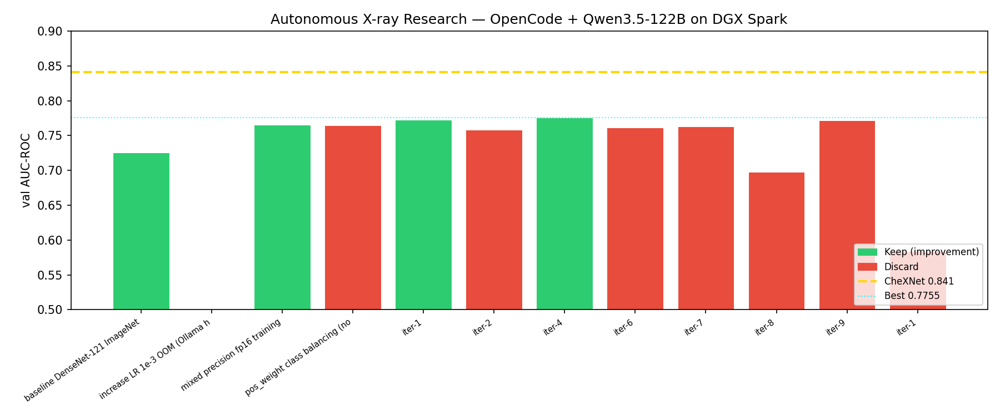

# Autonomous X-Ray Research on NVIDIA DGX Spark

An autonomous machine learning research loop for chest X-ray disease classification, running entirely on a single **NVIDIA DGX Spark (GB10 Grace Blackwell, 128 GB unified memory)**.

Inspired by [@karpathy's autoresearch](https://github.com/karpathy/autoresearch).

---

## What this does

A **Qwen3.5-122B** large language model — served locally by **vLLM** — acts as an AI research scientist. It reads the current training code, proposes one improvement, and writes new code. A fixed 10-minute training run then evaluates the improvement on the [ChestMNIST](https://medmnist.com/) dataset. Results are committed to git. If the new code beats the previous best AUC-ROC, it's kept; otherwise the commit is rolled back and the previous code is restored.

You go to sleep. You wake up to a log of experiments and (hopefully) a better model.

---

## System Architecture

```
┌──────────────────────────────────────────────────────────────────┐
│                  NVIDIA DGX Spark  (128 GB unified memory)       │
│                                                                  │
│  ┌────────────────────┐        ┌────────────────────────────┐   │
│  │  vLLM  (port 8080) │        │  Training Engine           │   │
│  │  ┌──────────────┐  │        │  ┌──────────────────────┐  │   │
│  │  │Qwen3.5-122B  │  │        │  │  DenseNet-121         │  │   │
│  │  │AWQ INT4 ~75GB│  │        │  │  7M params · fp16     │  │   │
│  │  └──────────────┘  │        │  └──────────────────────┘  │   │
│  └────────────────────┘        └────────────────────────────┘   │
│           ▲  REST API :8080              ▲  uv run train.py      │
│  ┌────────────────────────────────────────────────────────┐      │
│  │            OpenCode Agent  (Node.js)                   │      │
│  │     Tools: read · bash · write · glob                  │      │
│  └────────────────────────────────────────────────────────┘      │
│                        ▲  spawns                                  │
│  ┌────────────────────────────────────────────────────────┐      │
│  │            loop.sh  (bash orchestrator)                │      │
│  │     git commit · uv run · results.tsv logging          │      │
│  └────────────────────────────────────────────────────────┘      │
└──────────────────────────────────────────────────────────────────┘
```

**Key design choices vs. the original autoresearch:**

| | Original (karpathy) | This project |
|---|---|---|
| Task | GPT language modeling | 14-disease chest X-ray classification |
| Model trained | GPT (transformer) | DenseNet-121 (CNN, 7M params) |
| Dataset | FineWeb / TinyStories | ChestMNIST (78k train / 11k val) |
| Metric | val_bpb (lower is better) | val_auc (higher is better) |
| LLM agent | Claude / Codex | **Qwen3.5-122B-A10B-AWQ** (local) |
| LLM server | Ollama | **vLLM** (OpenAI-compatible) |
| Agent framework | Claude Code | **OpenCode** |
| Training budget | 5 min | 10 min |
| Hardware | Single NVIDIA GPU | NVIDIA DGX Spark GB10 |

---

## Results

All iterations are logged in `results.tsv`. Best achieved so far:

| Iteration | Technique (written by OpenCode) | val_AUC | Status |
|---|---|---|---|
| Baseline | DenseNet-121, Adam, fp32 | 0.7255 | keep |
| Manual exp-2 | Mixed precision fp16 | 0.7651 | keep |
| iter-1 | CosineAnnealingLR scheduler | 0.7725 | keep |
| iter-4 | **OneCycleLR + AdamW** | **0.7755** | **keep ★** |

CheXNet benchmark: **0.841** · Gap remaining: **0.066**
(CheXNet uses multi-day training; we use 10-minute budget per iteration)



---

## Project structure

```
loop.sh           — bash orchestrator: invokes OpenCode, git commits, trains, keeps/discards
train.py          — training script (modified by OpenCode each iteration)
prepare.py        — fixed infrastructure: data loading, evaluate_auc(), TIME_BUDGET=600
program.md        — task description and rules for the OpenCode agent
results.tsv       — experiment history (commit, val_auc, vram_gb, status, description)
plot_results.py   — generates results_chart.png after each iteration
pyproject.toml    — Python dependencies (uv)
```

---

## Requirements

- NVIDIA DGX Spark (GB10 Grace Blackwell, 128 GB unified memory recommended)
- [uv](https://docs.astral.sh/uv/) package manager
- [vLLM](https://github.com/vllm-project/vllm) 0.20.0 (NVIDIA build)
- [OpenCode](https://github.com/sst/opencode) v1.14.28+
- Model: `QuantTrio/Qwen3.5-122B-A10B-AWQ` (download from HuggingFace, ~75 GB)

---

## Setup

```bash
# 1. Download Qwen3.5-122B-A10B-AWQ (~75 GB)
python3 -c "
from huggingface_hub import snapshot_download
snapshot_download('QuantTrio/Qwen3.5-122B-A10B-AWQ',
                  local_dir='/home/nvidia/models/Qwen3.5-122B-A10B-AWQ')
"

# 2. Start vLLM server
vllm serve /home/nvidia/models/Qwen3.5-122B-A10B-AWQ \
    --port 8080 \
    --enable-auto-tool-choice \
    --tool-call-parser qwen3_xml \
    --max-model-len 65536 \
    --gpu-memory-utilization 0.90 &

# 3. Install dependencies and run a single training experiment
uv sync
uv run prepare.py   # one-time data download
uv run train.py     # ~10 min test run

# 4. Configure OpenCode to use local vLLM
#    See ~/.config/opencode/config.json below

# 5. Run the autonomous loop
chmod +x loop.sh
./loop.sh
```

### OpenCode config (`~/.config/opencode/config.json`)

```json
{
  "$schema": "https://opencode.ai/config.json",
  "provider": {
    "vllm": {
      "npm": "@ai-sdk/openai-compatible",
      "name": "vLLM (DGX Spark local)",
      "options": { "baseURL": "http://localhost:8080/v1" },
      "models": {
        "/home/nvidia/models/Qwen3.5-122B-A10B-AWQ": {
          "name": "Qwen3.5-122B-A10B AWQ (local)",
          "contextLength": 32768,
          "maxTokens": 4096
        }
      }
    }
  },
  "model": "vllm//home/nvidia/models/Qwen3.5-122B-A10B-AWQ"
}
```

---

## How the loop works

```
loop.sh iteration N
  │
  ├─ 1. Read BEST_AUC from results.tsv
  ├─ 2. Invoke OpenCode: "Read train.py, results.tsv, program.md.
  │                        Choose ONE improvement. Write new train.py. Stop."
  ├─ 3. OpenCode → vLLM REST API (POST :8080/v1/chat/completions)
  ├─ 4. Qwen3.5-122B reasons in <think>...</think>, reads files, writes train.py via bash heredoc
  ├─ 5. Syntax check: python3 -m py_compile train.py
  ├─ 6. git commit train.py
  ├─ 7. uv run train.py  (10 minutes, ~2400 gradient steps)
  ├─ 8. Parse val_auc from run.log
  ├─ 9. If val_auc > BEST_AUC → STATUS=keep, else git reset + git checkout train.py
  └─ 10. Append to results.tsv, regenerate results_chart.png → repeat
```

**Why bash heredoc (not edit tool)?** OpenCode's `edit` tool has JSON schema reliability issues with Qwen3.5. `bash` + `cat heredoc` has no schema — it either works or produces a syntax error caught by `py_compile`.

---

## License

MIT
